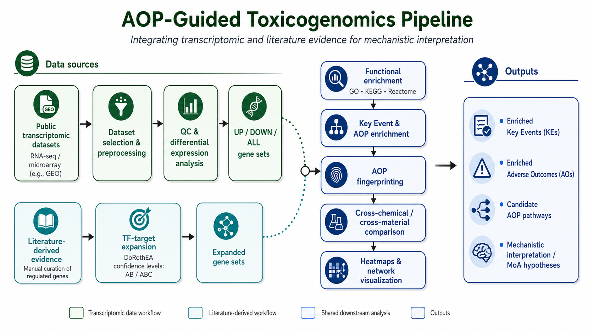

# AOP-Guided Toxicogenomics Pipeline

An analysis pipeline that combines transcriptomic differential expression and
literature-derived gene sets with functional enrichment, Key Event enrichment,
Adverse Outcome Pathway (AOP) fingerprinting, heatmaps, and network
visualization.



## Workflow

1. Run DESeq2 quality control and differential expression.
2. Expand literature-derived gene sets with DoRothEA transcription-factor
   targets at AB and ABC confidence levels.
3. Run GO, KEGG, and Reactome enrichment.
4. Enrich Key Events and create AOP fingerprints.
5. Render cross-experiment AOP heatmaps.
6. Render functional-enrichment heatmaps.
7. Optionally build an AOP-Wiki subnetwork in R or Python.

## Repository layout

```text
.
├── assets/                 # Documentation images
├── data/                   # Local inputs (ignored except for documentation)
├── outputs/                # Generated results (ignored)
├── scripts/                # Numbered analysis steps and shared configuration
├── run_pipeline.R          # Sequential pipeline runner
├── setup.R                 # renv dependency bootstrap
└── requirements.txt        # Optional Python network dependencies
```

## Requirements

- R 4.4.x and Bioconductor 3.20.
- System libraries needed by common R graphics/network packages. On
  Debian/Ubuntu these commonly include `libcurl4-openssl-dev`,
  `libfontconfig1-dev`, `libglpk-dev`, and `libssl-dev`.
- Python 3.10 or newer only if using the Python network visualizer.

## Setup

Clone the repository, open a terminal at its root, add the inputs described in
[`data/README.md`](data/README.md), and create the R environment:

```bash
Rscript setup.R
```

The setup script initializes `renv`, installs the CRAN/Bioconductor packages and
`fhaive/AOPfingerprintR`, and writes `renv.lock`. Commit the generated lockfile
and `renv` bootstrap files so collaborators restore the same environment.

For the optional Python implementation of step 7:

```bash
python -m venv .venv
python -m pip install -r requirements.txt
```

## Run

Run steps 1-6 in order:

```bash
Rscript run_pipeline.R
```

Select specific steps or preview the execution order:

```bash
Rscript run_pipeline.R --steps=1,3,6
Rscript run_pipeline.R --steps=1,2,3,4,5,6,7 --dry-run
```

Each numbered script can also be run directly from the repository root. Step 02
and both step-07 scripts expose command-line options:

```bash
Rscript scripts/02_tf_target_expansion.R --help
Rscript scripts/07_aop_network.R --help
python scripts/07_aop_network.py --help
```

Generated tables, figures, serialized enrichment objects, and interactive HTML
files are written under `outputs/` and are intentionally excluded from Git.

## Reproducibility and publication notes

- The random seed and shared paths are defined in `scripts/_config.R`.
- Raw data and generated outputs are not tracked. Document stable accessions,
  checksums, preprocessing, and download instructions for every released input.
- Review the chemical list and thresholds in `scripts/_config.R` before running
  a different dataset.
- The included GitHub Actions workflow checks R and Python syntax without
  downloading the full scientific software stack.

## License

No software license has been selected. Add a `LICENSE` file before public release
if you want others to be able to reuse or modify the code under stated terms.
